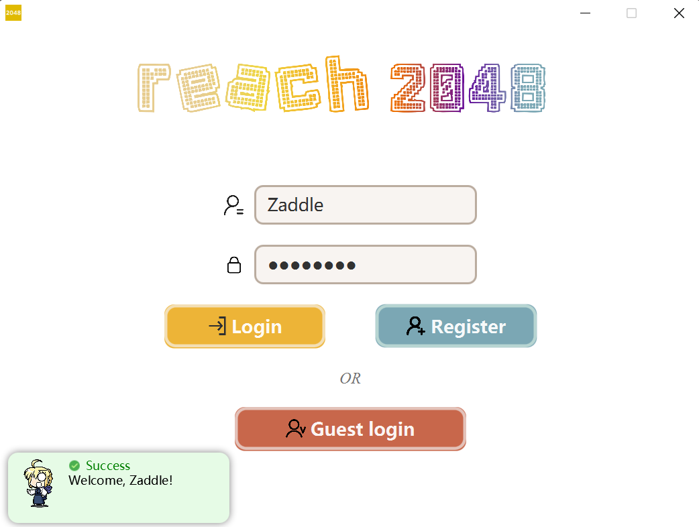
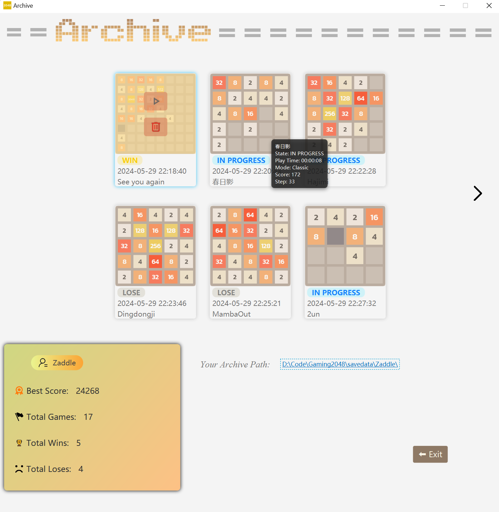
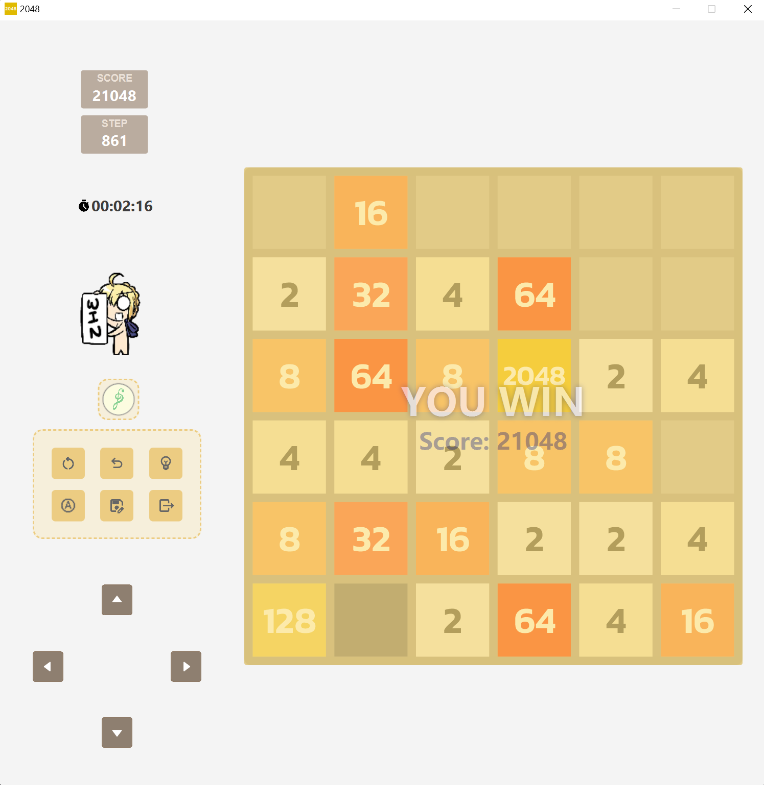
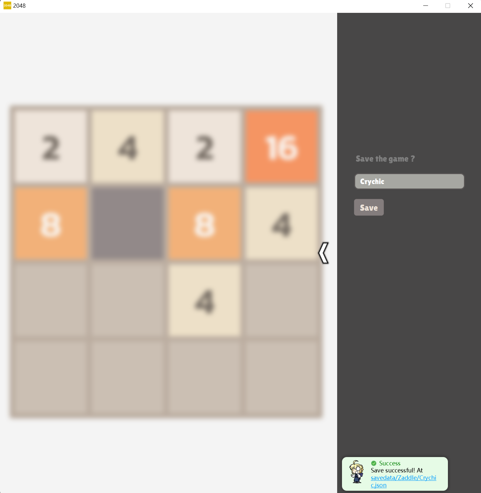

<!-------------------This is beginning.------------------->

<!--
    -----------------Put logo here----------------------
-->

    <h1>
    Reach 2048 |
    
    </h1>

 

<!-------------------Put tag here------------------->

    

    &emsp;
    
    

<!-------------------Put introduction here------------------->

    <h2>📕 Project Introduction</h2>
    
The project "2048" for 2024 Spring Java A course.

    
Use <b><i>maven</i></b> for requirement management, <b><i>JavaFX</i></b> to construct gui, <b><i>Gson</i></b> for data serialization.

    
Frame, game logic from @zaddle55; AI, user management from @SUSTechCJK2023

    
Points: 110/110

<!-------------------Put running demo here------------------->

    <h2>🎮 Sample Runtime Screenshot</h2>
    <!-------------------Several images here...------------------->
    <h3>1. Register and login</h3>
    
    <h3>2. Archive</h3>
    
    <h3>3. Game</h3>
    
    <h3>4. Save the game</h3>
    

<!-------------------Put how to run on local here------------------->

    <h2>🛠️ How to build on local</h2>
    

    1. <a href="https://download2.gluonhq.com/openjfx/21.0.2/openjfx-21.0.2_windows-x64_bin-sdk.zip">Download JavaFX SDK 21.0.2</a> and put it at your java-lib path.
    

    

    2.Add Virtual Machine Options: <code>--module-path
    "C:\Program Files\Java\lib\javafx-sdk-21.0.2\lib"
    --add-modules
    javafx.controls,javafx.fxml
    --add-modules
    javafx.controls,javafx.media
    --add-exports
    javafx.graphics/com.sun.glass.utils=ALL-UNNAMED
    --add-exports
    javafx.graphics/com.sun.javafx.tk.quantum=ALL-UNNAMED</code> to run <code>Main.java</code>
    

<!-------------------Put develop notes here------------------->

    <h2>✍ Develop Review</h2>
    <!-------------------Several urls here...------------------->

<!-------------------Put Release here------------------->

    <h2>📥 Download It</h2>

 

  <h2>🌟 About this repo</h2>

<!--
    -----------------Put MoeCounter here-----------------
-->

  

  
<!--
    -----------------Put star graph here-----------------
-->
<picture>
  <source
    media="(prefers-color-scheme: dark)"
    srcset="
      https://api.star-history.com/svg?repos=zaddle55/Gaming2048&type=Date&theme=dark
    "
  />
  <source
    media="(prefers-color-scheme: light)"
    srcset="
      https://api.star-history.com/svg?repos=zaddle55/Gaming2048&type=Date&theme=light
    "
  />
  
</picture>
